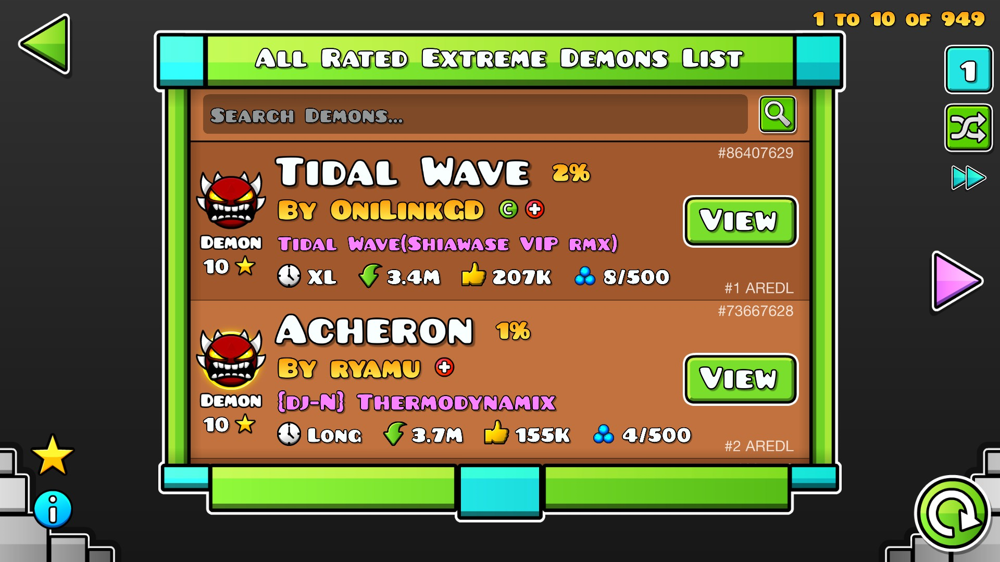
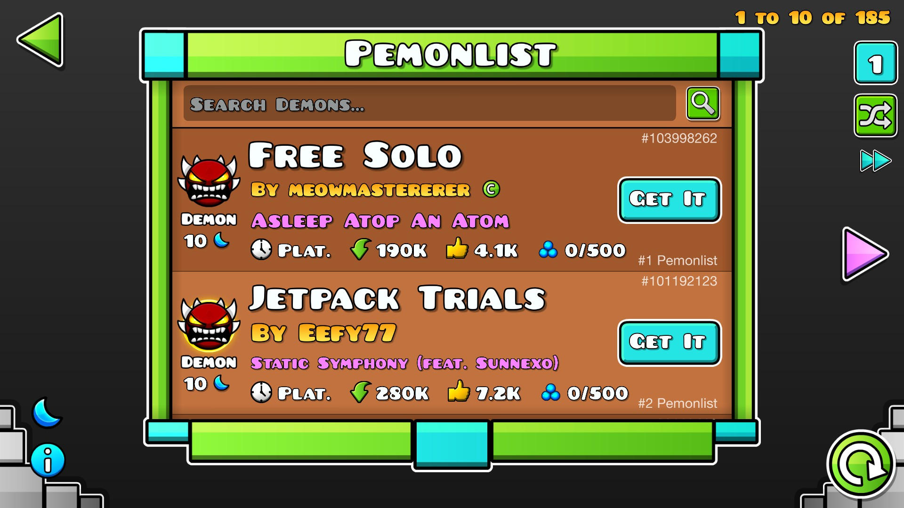

# Integrated Demonlist
A mod that integrates [aredl.net](https://aredl.net) and [pemonlist.com](https://pemonlist.com) into Geometry Dash.

# Features
- A new button in the level/list search screen that opens the demon list.
- A search box that allows you to search for a demon in the list by name.
- Page navigation buttons that allow you to navigate through the list.
- Buttons that allow you to switch between the AREDL (For classic demons) and the Pemonlist (For platformer demons).
- If on the list, and if enabled, there will be text on the demon's search box that states its position on the list.

# Gallery
\

# License
This mod is licensed under the [MIT License](./LICENSE).